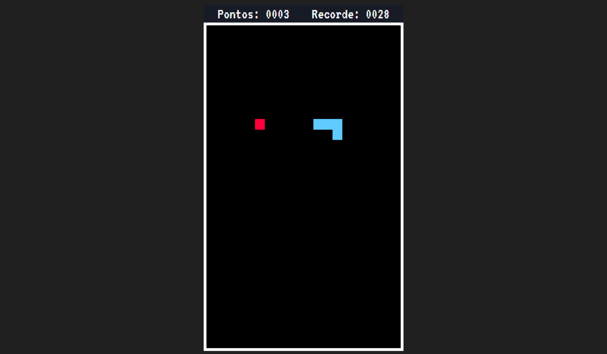

# Game Snake

## Sobre o jogo:
Snake, também conhecido como "jogo da cobrinha" é um jogo que ficou conhecido por diversas versões cuja versão inicial começou com o jogo Blockade de 1976, sendo feitas várias imitações em vídeo-games e computadores. o jogo foi lançado para celulares Nokia em 1998 e se tornou popular.

O jogador controla uma longa e fina criatura que se arrasta pela tela, coletando comida (ou algum outro item), não podendo colidir com seu próprio corpo ou as "paredes" que cercam a área de jogo. Cada vez que a serpente come um pedaço de comida, sua cauda cresce, aumentando a dificuldade do jogo. O usuário controla a direção da cabeça da serpente (para cima, para baixo, esquerda e direita) e seu corpo segue.

## Como jogar
Utilize as setas de direção para mover a cobrinha.

<<<<<<< HEAD
<h3>Informações:</h3>

Pojeto desenvolvido utilizando apenas HTML, CSS e JavaScript

=======
## Informações
Projeto desenvolvido utilizando apenas HTML, CSS e JavaScript.
>>>>>>> 525bbf18442a0a5b60bbacd120e561640ce5bb42
